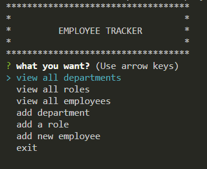

# Week 12 - Employee Tracker

## Table of Contents 
- [Description](#description)
- [Licensing info](#license)
- [Questions + Contact](#questions)
- [Demo](#demo)

## Demo
[Demo Walkthrough Video](https://watch.screencastify.com/v/h9ZQqKmR3ilZszFcF3sm)

## Description
this project is a command console prompt application for a company/ business to create a console table/ database to keep information on their employees, ddepartments and their roles.

## Installation Instructions
Start by cloning the repository to your local machine
   
 open the folder in VScode (or a coding app similiar) 
   
 in the console, type npm install 
   
 type: node app.js to run the file in the command console.
  
 and follow the prompts

## Usage Information
test and learning

## License

 
[License information](https://opensource.org/licenses)

## Contributing
this is an open source project, you may use and change at your own leisure

## Test Instructions
in command console, type npm i or npm install   then once dependencies are downloaded type npm start to run app.js   or just type node app.js

## Questions
feel free to contact me, for any questions or improvements you think of

Visit my GitHub profile here: [JRoberts94](https://github.com/JRoberts94)
 
Email: jake.shaun.roberts1994@gmail.com

## Deployment

 
[GitHub repo](https://github.com/JRoberts94/Week12-Employee-Tracker)

## Technology used
javascript   node.js   npm   mysql
